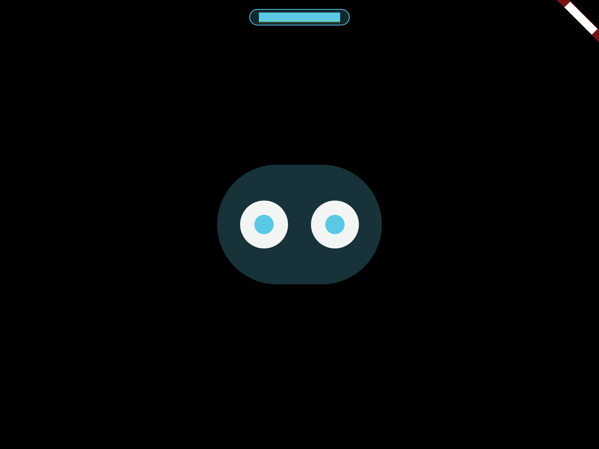
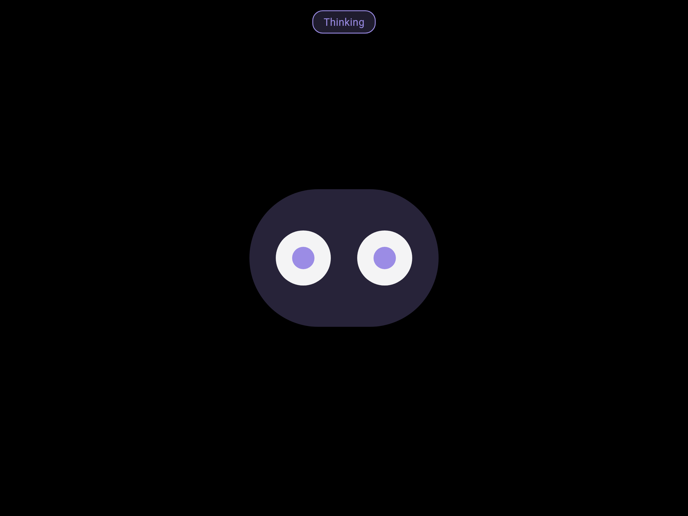
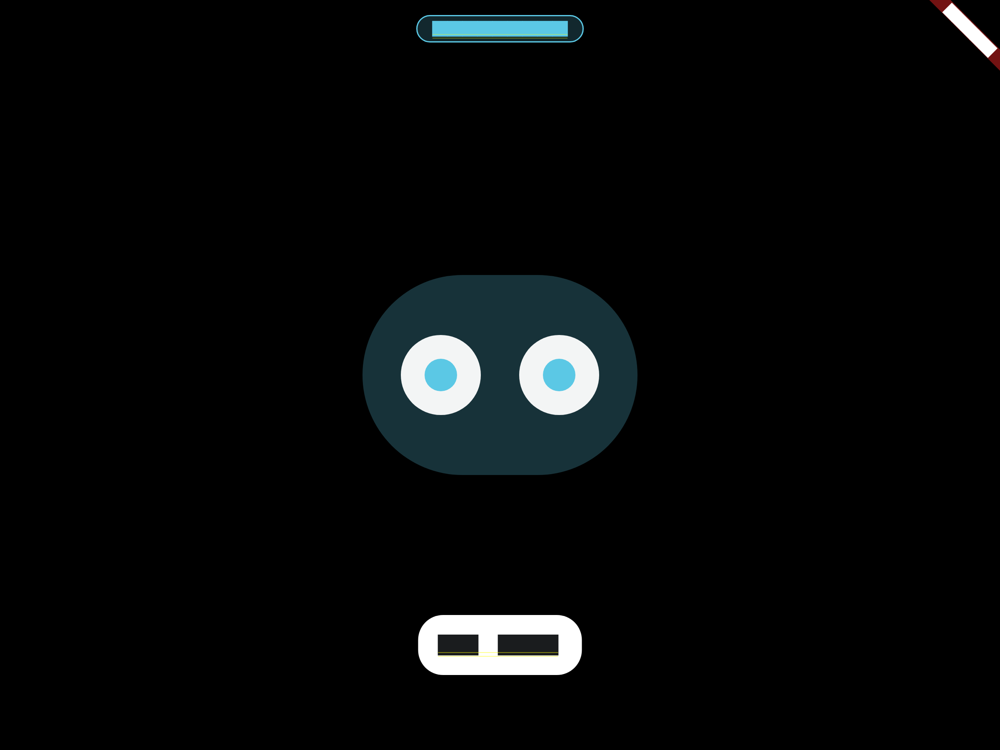
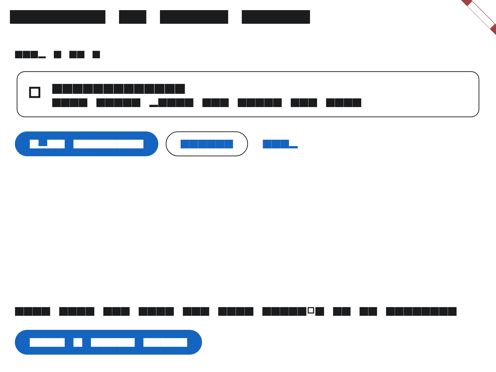
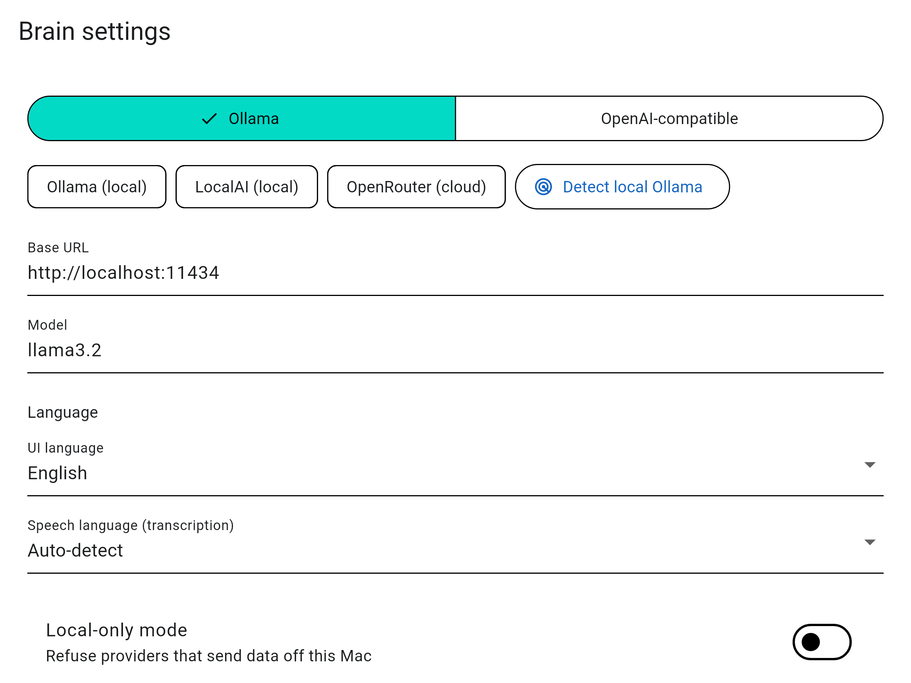

# Local Bluey

A blueberry character who lives on your iPhone under your Mac's screen and points at things with his own big cursor - now as a **Flutter app** for **macOS, iOS and Android** that can run **fully locally**. Forked from [rbrown101010/bluey-by-riley](https://github.com/rbrown101010/bluey-by-riley) and rebuilt: the hardcoded OpenAI Realtime WebSocket is gone, replaced by a modular brain that talks to local [Ollama](https://ollama.com) or any OpenAI-compatible API (OpenRouter, LocalAI, OpenCode…).

[](https://github.com/shpalac/local-bluey/actions/workflows/ci.yml)

**How it feels:** double tap his face to wake him. **Press and hold** to ask something; let go and he answers in a speech bubble. Ask "what's this?" and he points at whatever is under your mouse. Double tap again and he goes back to quietly following your pointer with his eyes.

**Using the computer:** when you ask, he can click, type, press shortcuts, scroll, drag, zoom into a region of the screen, wait for something to appear, and open apps and websites - with his own cursor, while your real pointer is put back where you left it. Needs Accessibility permission on the Mac.

## Screenshots

<table>
  <tr>
    <td></td>
    <td></td>
  </tr>
  <tr>
    <td></td>
    <td></td>
  </tr>
  <tr>
    <td></td>
    <td></td>
  </tr>
</table>

Generated by the deterministic screenshot harness (`tool/regenerate_screenshots.sh`, see [#180](https://github.com/shpalac/local-bluey/issues/180)).

## Status

- **Platforms today:** macOS (the host that sees and controls the computer) and iOS + Android (the phone clients). App roles are chosen by capability through a support matrix, not `Platform.isMacOS`, and platforms with no supported role (Linux, Windows) get an explicit unsupported screen instead of a broken UI. Computer control is native on macOS; Linux has experimental X11 and Wayland backends (see below) and Windows has none yet. The full matrix is in [docs/SUPPORT.md](docs/SUPPORT.md).
- **Android:** a phone client only (same role as iOS: hold-to-talk and the Mac link). CI builds a debug APK and runs `integration_test/` on an Android emulator (API 29 and 34); the native MethodChannel is mocked there, so this checks the Dart side only. It has not been tested on a real device yet.
- **Linux:** an experimental, best-effort host. There is an X11 backend (`lib/services/linux_x11_host_control.dart`, using `import` and `xdotool`) and a Wayland portal path, but [docs/SUPPORT.md](docs/SUPPORT.md) still lists Linux as an unsupported role in the app, and none of it has run on a real desktop. CI builds the release bundle, packages a tarball, and runs a phone-to-host test over loopback TCP against Xvfb (`test/e2e_phone_host_test.dart`). [docs/LINUX_HOST_SPIKE.md](docs/LINUX_HOST_SPIKE.md) has the background.
- **Implemented:** Ollama and OpenAI-compatible brains, a settings screen, transcription and spoken answers over OpenAI-compatible HTTP endpoints, native tool calling, screenshot vision with zoom, a safety gate with confirmations and a kill switch, a local-only mode with screen-text redaction, a persistent action log and a data-egress report, unified data deletion and retention controls, conversation memory summaries, retry with backoff on dropped requests, onboarding with live permission checks, English/Hebrew UI with RTL and light/dark appearance, personality with moods and selectable characters, routines (user-defined macros), haptics on the phone client, empty/error/undo patterns, offline-first graceful degradation, optional biometric app lock, suggestions and search over past answers, and Mac-to-phone hold-to-talk over the local network.
- **Not done yet:** see the open [issues](https://github.com/shpalac/local-bluey/issues), including a real on-device wake-word spotter ([#79](https://github.com/shpalac/local-bluey/issues/79)) and real-device validation ([#15](https://github.com/shpalac/local-bluey/issues/15)). Nothing here has been verified on real hardware: the emulator and Xvfb runs use mocked or loopback boundaries. The first hardening pass from the code review (tracker [#124](https://github.com/shpalac/local-bluey/issues/124): kill switch, link authentication, recordings, local-only enforcement) is merged; follow-ups are in the issue list.

## Privacy: what stays local

Nothing is local unless you point it at a local endpoint. The brain, transcription and speech each use the endpoint you configure (the brain's URL by default for transcription and speech). With Ollama on your machine, nothing leaves it. If you configure a remote endpoint, your prompts, recorded audio and screenshot text are sent to that provider.

- **Local-only mode** (setting): refuses any brain, transcription or speech endpoint that is not loopback (`localhost`, `127.x.x.x`, `0.0.0.0`, `::1`). `.local` names resolve off-device, so they do not count as local (#120, #121).
- **Redaction:** screen text is scrubbed of email addresses, 16-digit card numbers and 9-digit numbers before it reaches the brain. This is pattern matching, so it is not a guarantee. When the screen text matches a pattern, the screenshot and any zoom crop of that screen are withheld too, since the pixels would show the same data (#122). A screen without a pattern match is still sent as an image when the brain asks for one.
- **Voice recordings:** hold-to-talk captures are deleted after use, leftovers are swept on start, and a recording stops after 2 minutes (#116, #117).
- **Egress report:** Settings > Data and privacy shows a verifiable record of what was sent, where and when, plus an offline self-test. Retained metadata is loaded at startup and before the first record; record/load/delete operations are ordered so completed deletion cannot be undone by an older write. Missing storage means no retained entries, not proof of no historical transmission. Unreadable or partly corrupt history is reported as unavailable/incomplete and is not overwritten until successful explicit deletion ([#58](https://github.com/shpalac/local-bluey/issues/58)).
- **API keys:** stored with `flutter_secure_storage` (Keychain on macOS and iOS), not in plain preferences.

## Safety

Tools that change your machine (`click`, `type_text`, `press_keys`, `scroll`, `drag`, `open_app`, `open_url`) ask for confirmation first, and `open_app` can be limited to an allowlist. A global kill switch cancels actions in flight (#107). An optional biometric app lock (Touch ID / Face ID / device biometrics) can gate the app. The Mac-to-phone link no longer sends the pairing key: the Mac issues a nonce and the phone answers with an HMAC of it, and the Mac shows one pairing prompt at a time (#111, #112). The link is still plain TCP on the local network, so treat it as trusted-network only.

## Docs

- [docs/USER_GUIDE.md](docs/USER_GUIDE.md) - gestures, voice flows, tools, safety and privacy for people using the app
- [CONTRIBUTING.md](CONTRIBUTING.md) - dev loop, PR conventions, test expectations
- [docs/architecture.md](docs/architecture.md) - the layers and data flow
- [docs/dev-setup.md](docs/dev-setup.md) - per-platform setup and device checklist
- [Landing page](docs/index.html) (serve the repo with GitHub Pages from /docs)

## Architecture

| Layer | Tech | What it does |
|---|---|---|
| UI | Flutter (Dart) | His face, gestures, speech bubble, menu-bar tray (macOS) |
| Brain | `lib/llm/` | `OllamaProvider` (local `/api/chat`) or `OpenAiCompatibleProvider` (any `/chat/completions` endpoint) |
| Tools | `lib/services/tool_executor.dart` | Runs the 14 tool calls (`look_at_screen`, `zoom_screen`, `wait`, `point_at`, `click`, `type_text`, …) the LLM emits |
| Native bridge | Flutter MethodChannel → Swift | ScreenCaptureKit + Vision OCR, Accessibility controls, CGEvent mouse/keyboard |
| Phone ↔ Mac | Bonjour (`nsd`) + newline-delimited JSON over TCP | The phone finds the Mac on the local network and mirrors his face |

The original Swift implementation is kept under `Mac/`, `iOS/` and `Shared/` as reference for the port.

## Run it

Requirements: Flutter (stable, Dart SDK ^3.13.5), a Mac for the desktop app, and either Ollama or an OpenAI-compatible endpoint. A phone is optional and needs to be on the same network as the Mac.

```bash
flutter pub get
flutter run -d macos   # the Mac app (grants Accessibility + Screen Recording on first use)
flutter run -d ios     # the iPhone app - it finds the Mac over Bonjour
flutter run -d android # the Android app - same discovery and hold-to-talk
```

No API keys in the repo: Ollama needs none; remote endpoints are configured in the app.

## Local data and retention

Everything the app stores lives on this device; Settings > Data and privacy lists each store with a clear button, and "Delete all local data" returns the app to first-run state (it does not touch your remote provider account data).

| Store | Where | Retention |
| --- | --- | --- |
| Conversation history + summary | Documents/conversation.json | Until deleted |
| Action log | Documents/actions.jsonl | 500 entries / 30 days |
| Egress record | Documents/egress.jsonl | 300 entries / 30 days |
| Routines | Documents/routines.json | Until deleted |
| Perf samples | Documents/perf.jsonl | Until deleted |
| Settings (API key in Keychain) | SharedPreferences + secure storage | Until deleted |
| Character, language, onboarding, safety, privacy, wake-word, app lock, haptics, notifications, theme, pairing/link keys | SharedPreferences | Until deleted |

## Development

- `flutter test` - unit + widget tests (tool-call parsing, executor math, protocol round-trips)
- `flutter test integration_test` - E2E: hold-to-talk → mock LLM → tool call through the MethodChannel
- CI (GitHub Actions, `.github/workflows/ci.yml`; skipped for docs-only and `.md` changes): `ubuntu-latest` lanes for format and analyze, unit and widget tests with coverage floors (`tool/check_coverage.dart`), a debug APK build, Android emulator integration tests (API 29 and 34, mocked native boundary), Linux (tests, an Xvfb phone-to-host test, release build, tarball), a dependency vulnerability scan (pinned OSV binary, also weekly on schedule), secrets scans, and a pinned-actions, actionlint and zizmor lane. All lanes run in parallel (no gating between the fast and build lanes). Two `macos-latest` jobs build the macOS app and the iOS app (`--no-codesign`) concurrently. A self-hosted macOS lane (`flutter test integration_test -d macos`) only runs when `ENABLE_NATIVE_VALIDATION` is set. Actions are pinned by SHA, permissions are least-privilege, and the workflow sets `shell: bash` so piped log steps (`| tee`) fail when the command fails (#142).

## OS integration (#91)

Deep links use the `localbluey://` scheme. Supported actions (validated in `lib/services/deep_links.dart`):

- `localbluey://wake` / `localbluey://sleep` - same wake/sleep path as the face gesture
- `localbluey://ask?text=<question>` - asks Bluey (text required)
- `localbluey://stop` - kill switch
- `localbluey://mute` - stops in-flight speech
- `localbluey://status` - shows current state

Deep links never run computer-control or other confirm-required actions silently; those stay behind the in-app safety gate (#19, #57).

The macOS tray offers quick actions: Ask Bluey (wake), Mute replies, Status, plus Show/Hide/Stop/Resume/Quit.

Mac hold-to-talk key (#228): in Settings, switch on "Hold a key to talk" to hold a key alone from any app (default Right Command, 400 ms; Left Command, Right Option and Fn/Globe also offered), release to send, Esc to cancel. Off by default. It needs the macOS Input Monitoring permission; without it the switch stays on but the shortcut does nothing and Settings says why. Any other key during the hold cancels it, so Cmd+C and Cmd+Tab are untouched. Works on the Mac alone, no phone needed. System-wide capture and the sandbox entitlements are not yet verified on a real Mac.

Platform limits: iOS App Intents/Shortcuts and widgets need native platform registration and are tracked as follow-up work.

